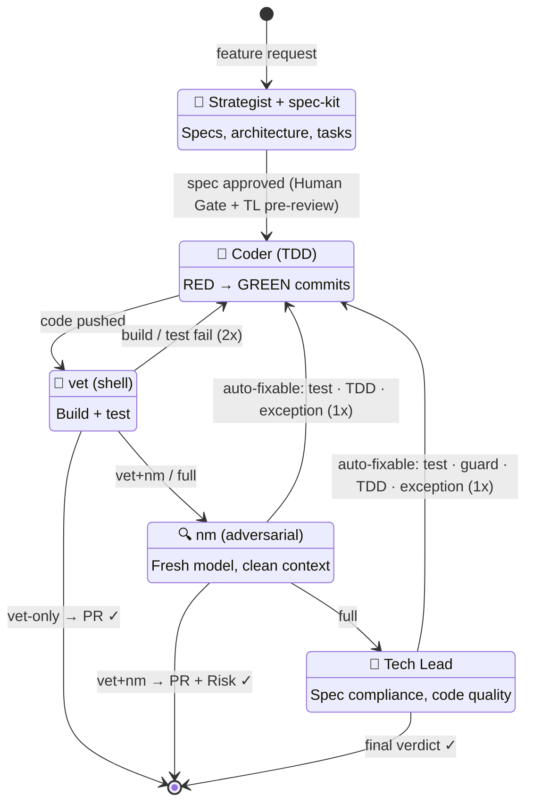

# Dokima

**Multi-agent orchestration engine.** Routes feature development through a pipeline of specialist AI agents — with automated depth-gating, prompted TDD discipline, and two independent adversarial reviews. Works with Hermes Agent (primary). Claude Code and Codex support in development.

## Why

You asked an AI to add a dark mode toggle.

It installed Tailwind. Refactored your CSS. Wrote 14 components, a theme context, a provider, three hooks, and a README explaining its design philosophy. The toggle doesn't work. The tests pass — it wrote those too.

One agent, zero accountability, unlimited ambition. Give it a button and it builds you a space elevator.

Dokima puts five agents in a room and makes them distrust each other. The strategist writes the spec — because "just code it" is the fastest route to 47 files for a button. The coder tests first (RED commit, GREEN commit, or it didn't happen). vet runs the build with zero AI tokens — shell scripts don't hallucinate, and they certainly don't install Tailwind. nm reviews from a fresh session — configured to use a different model family, because nobody grades their own homework (note: the panel shells out to `~/bin/nm` and cannot enforce which model nm uses — requires nm to be pre-configured with a different model family). The Tech Lead checks the spec, checks the code, and checks for space elevators.

**What comes out:** passing tests, passing build, a PR with two independent reviews, all automated. **What doesn't:** a CSS framework you didn't ask for.

## Quick Install

The fastest way to get dokima on your machine. Installs the panel and companion scripts — profiles and provider config come next.

```bash
curl -sSL https://raw.githubusercontent.com/siongsheng/dokima/main/install.sh | bash
```

This checks prerequisites (Python 3.6+, gh CLI, Hermes Agent), clones the repo to `~/.local/share/dokima`, and symlinks `dokima`, `nm`, and `vet` into `~/.local/bin`. Add `--with-profiles` to create agent profiles automatically:

```bash
curl -sSL https://raw.githubusercontent.com/siongsheng/dokima/main/install.sh | bash -s -- --with-profiles
```

### Verify

```bash
dokima --help          # should print usage
nm --help              # adversarial review runner
vet --help             # build + test verifier
```

> **Full setup (provider config, API keys, GitHub token):** use the [Quick Start](#quick-start) below or see the [setup guide](docs/setup.md).

## Quick Start

### One-liner (Linux/macOS)

The setup script walks you through everything — provider choice, API keys, GitHub token, profile creation. Works with DeepSeek, Anthropic, OpenAI, or OpenRouter.

```bash
curl -fsSL https://raw.githubusercontent.com/siongsheng/dokima/main/scripts/setup-linux.sh | bash
```

### Windows (PowerShell)

```powershell
irm https://raw.githubusercontent.com/siongsheng/dokima/main/scripts/setup-windows.ps1 | iex
```

### Manual install

```bash
# Clone
git clone https://github.com/siongsheng/dokima.git ~/dokima

# Install (symlink to PATH)
ln -sf ~/dokima/dokima ~/bin/dokima
```

### Usage

```bash
# Run on any project with AGENTS.md + git remote
dokima "Add rate limiting middleware" ~/project

# Fix a BLOCKED PR: detect blockers, fix, verify
dokima --fix ~/project

# Force all 5 phases (even for low-risk changes)
PANEL_FORCE_FULL=1 dokima "Add payment webhook" ~/project

# Resume after strategist interview
dokima --answers /tmp/dokima-interview.json "Add API key auth" ~/project
```

> **Full setup guide:** [docs/setup.md](docs/setup.md) — one-time machine setup, per-project config, troubleshooting.

## Pipeline



| # | Stage | Who | What |
|---|-------|-----|------|
| 0 | **Human Gate** | You | Review the spec before code gets written |
| 1 | **Strategist** | `strategist` profile | Explores codebase, designs spec with test plan (edge cases + failure modes), produces task list |
| 2 | **Coder** | `coder` profile | TDD: RED → GREEN commits, parallel waves |
| 3 | **vet** | Shell (zero AI) | Build + test. Fail → coder fix → re-verify |
| 4 | **nm** | Fresh session, different model | Adversarial review, PR with risk assessment |
| 5 | **Tech Lead** | `tech-lead` profile | Spec compliance, architecture, code quality review |

**vet is the minimum** — every change gets build + tests. Depth gating, loopback rules, and full phase details: [docs/pipeline.md](docs/pipeline.md).

## Design

Dokima doesn't ask "how many agents?" It asks: **what unique failure class does each stage catch?**

Most multi-agent systems add stages to look impressive. Hermes adds a stage only when it catches something no other stage can — and only when the catch justifies the tokens.

Every stage has a contract:

| Stage | Information it sees | Unique failure mode it detects | Does NOT detect |
|-------|-------------------|-------------------------------|-----------------|
| **Human Gate** | The spec | Misaligned intent — spec describes wrong thing | Code quality, edge cases |
| **Strategist** | Codebase + AGENTS.md + brief | Unbounded ambition — overbuilding without design | Whether the spec is implementable |
| **Coder** | Spec (incl. test plan) + task list | Implementation gaps — spec says X, code does Y | Whether the spec is correct |
| **vet** | Build + test output | Broken builds, failing tests — ground truth | Design issues, architecture drift |
| **nm** | Git diff (different model family) | Model-family blind spots — same inductive bias would miss these | Spec compliance (doesn't see the spec) |
| **Tech Lead** | PR + spec + full context | Spec non-compliance, architecture drift, system-wide inconsistency | Blind spots from the coder's model family |

**Why not fewer?** Strategist → Coder → vet would ship code that passes tests but might not match the spec (no adversarial review, no spec-compliance check). Every skipped stage leaves a failure class uncovered.

**Why not more?** Adding stages without eliminating overlap is anti-Hermes. A Test Architect overlaps with Strategist (both design upstream). A separate Security Reviewer overlaps with nm (both review code). The bar for a new stage is: *prove it catches a failure class no existing stage can catch, with evidence, not intuition.*

**Coherence vs Specialization.** nm and vet are specialists — each catches one category. TL is the coherence anchor — the only stage that asks "does this change make the SYSTEM consistent?" TL checks twice: once on the spec before code (architectural impact, test plan), once on the PR after code (spec compliance, architecture drift). Distributed checks without a coherence anchor produce locally correct components and globally broken systems.

## Features

- **Human gate** — pauses after strategist so you can review the spec before code gets written. `[y]` review in less, `[e]` edit in vim, `[Enter]` approve, `[q]` abort. Auto-skipped in non-interactive mode.
- **Project-agnostic** — takes any repo path. Reads test/build/lint commands from `AGENTS.md`.
- **TDD prompted** — coder is instructed to use RED→GREEN two-commit discipline. nm reviews check for bundled commits.
- **Parallel coders** — worktree isolation with task claiming. DAG-based wave scheduling.
- **Filtered auto-fix** — nm and TL loop back to Coder for objective issues (missing tests, uncaught exceptions, TDD violations). Architecture and spec findings stay human-only. Re-verified after fix. `PANEL_SKIP_AUTOFIX=1` to disable.
- **Cost-optimized** — depth-gating skips unnecessary phases. Shell verification (zero AI tokens), flash model for coding, compressed lite skills, spec noise extraction, task-extract (coder reads condensed task breakdown, not the full spec).
- **Two adversarial reviews** — nm (fresh model, different family) + TL (spec compliance). Two independent models catch different classes of bugs.
- **Graceful degradation for coder and tech lead phases** — timeouts produce partial results, not failures (strategist short output aborts). Partial review > no review.
- **ADR lifecycle** — strategist reads past architectural decisions before designing. Panel creates new ADRs from decision tables. TL checks spec against existing ADRs. Powered by [adr-tools](https://github.com/npryce/adr-tools).
- **Auto-archive specs** — panel detects merged PRs at startup and archives completed specs to `specs/archive/`. Keeps `specs/STATUS.md` current. Skip with `PANEL_SKIP_AUTO_ARCHIVE=1`.
- **Error recovery & resume** — if the pipeline crashes mid-run, `--resume` re-starts from the last completed phase instead of restarting from scratch. Checkpoints saved after each phase preserve partial state (spec file, branch, task extract, PR URL). `--no-resume` ignores any existing checkpoint. Env vars: `PANEL_RESUME=1`, `PANEL_NO_RESUME=1`.
- **--fix mode** — `dokima --fix [project_dir]` detects the most recent BLOCKED PR, extracts blocker descriptions from the TL review section, feeds them to the coder as a targeted fix task, and runs vet→nm→TL verification. Full pipeline always runs (fixes are high-risk). `PANEL_FIX_ALL=1` includes SHOULD FIX items. `PANEL_SKIP_HUMAN_GATE=1` auto-proceeds. Does NOT re-run the strategist or create new branches.

## When NOT to Use

The panel is not the right tool for every change:

| Scenario | Use instead |
|----------|------------|
| **Trivial fixes** (typos, comments, formatting) | Direct commit. 6 stages for a typo is comedy. |
| **You already know the codebase deeply** | Direct TDD + `~/bin/nm`. The Strategist adds no value when you know the design. |
| **The change is purely mechanical** (rename, extract, reformat) | IDE refactor or sed. No design work needed. |
| **You need a quick experiment / spike** | One agent, no pipeline. The panel is for shipping, not exploring. |
| **No test suite exists** | Write tests first. The panel's TDD enforcement requires a test runner. |

The panel shines for **greenfield features with ambiguous requirements** where a fresh strategic perspective matters, and for **high-impact changes** where two independent reviews prevent costly mistakes.

## Requirements

- An AI agent runtime — [Hermes Agent](https://hermes-agent.nousresearch.com), [Claude Code](https://claude.ai), or [Codex](https://github.com/openai/codex)
- 3 agent profiles/workspaces: `strategist`, `coder`, `tech-lead` (see [setup guide](docs/setup.md))
- An AI model provider (DeepSeek, Anthropic, OpenAI, or OpenRouter) + optional secondary provider for nm adversarial review
- `gh` CLI (GitHub) installed and authenticated
- [adr-tools](https://github.com/npryce/adr-tools) installed (for ADR lifecycle support)
- `AGENTS.md` at project root with test and build commands
- GitHub remote configured on target project

> **Environment variables, exit codes, and file layout:** [docs/pipeline.md](docs/pipeline.md)

## Standing on Shoulders

The panel doesn't invent methodology. Every stage draws from battle-tested open-source ideas — integrated into a pipeline where each stage reinforces the next.

| Stage | Draws from | What we took | Why |
|-------|-----------|-------------|-----|
| **Strategist** | [Spec Kit](https://github.com/github/spec-kit) | Constitution-first development — mission, tech-stack, roadmap, conventions before any code | Spec-kit proved agents produce better code when they design first |
| | [ponytail](https://github.com/DietrichGebert/ponytail) | YAGNI laziness ladder — "Does this already exist? Can stdlib do it?" before writing a spec | Prevents the #1 waste in agentic coding: building things that don't need to exist |
| **Coder** | [Kent Beck's TDD](https://en.wikipedia.org/wiki/Test-driven_development) | RED → GREEN → REFACTOR cycle, enforced by the coder skill | 25 years of evidence: tests written first produce fewer defects |
| | AI Coding Best Practices | Task granularity (5-15 min), no scope creep, pipeline gates | Agents drift without guardrails. Small tasks keep them focused |
| **vet** | Unix philosophy (McIlroy, 1978) | Mechanical verification — shell script, zero AI tokens | Determinism. `cargo test` passes or fails — no hallucination surface. Every CI system works this way for the same reason |
| **nm** | [no-mistakes](https://github.com/kunchenguid/no-mistakes) | Fresh session, different model family, PR with risk assessment | Research shows adversarial review from independent models catches bias. The coding model can't review its own work |
| **Tech Lead** | GitHub PR review best practices + [Bacchelli & Bird, 2013](https://doi.org/10.1109/icse.2013.6606617) | Multi-dimensional review — spec compliance, architecture, security, test quality, style, drift | Microsoft Research: checklist structure beats reviewer seniority. A rubric catches more than free-form review |
| | [ponytail](https://github.com/DietrichGebert/ponytail) | Post-build laziness lens — "Is there a simpler way?" | Catches overbuilding that passed correctness review. 47-line wrapper → 1 stdlib call |

**The panel integrates proven ideas into a pipeline where each stage reinforces the next.** The strategist's spec gates the coder. The coder's tests gate the vet. The vet gates the review. Two independent models must agree before the TL signs off.

## Documentation

- **[docs/setup.md](docs/setup.md)** — Deployment guide: one-time machine setup, per-project config, smoke test, cron integration, troubleshooting.
- **[docs/pipeline.md](docs/pipeline.md)** — Full pipeline reference: phases, depth matrix, interview flow, token optimizations, failure handling, env vars, exit codes.

## License

MIT — see [LICENSE](LICENSE).
