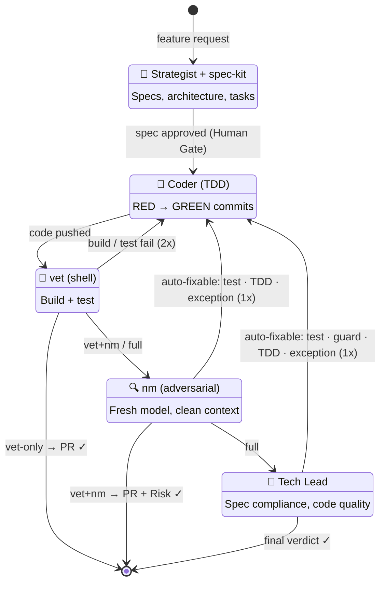

# Hermes Panel

**Multi-agent orchestration engine.** Routes feature development through a pipeline of specialist AI agents — with automated depth-gating, TDD enforcement, and adversarial review. Works with Hermes Agent, Claude Code, or any agent that can follow instructions.

## Why

You asked an AI to add a dark mode toggle.

It installed Tailwind. Refactored your CSS. Wrote 14 components, a theme context, a provider, three hooks, and a README explaining its design philosophy. The toggle doesn't work. The tests pass — it wrote those too.

One agent, zero accountability, unlimited ambition. Give it a button and it builds you a space elevator.

Hermes Panel puts five agents in a room and makes them distrust each other. The strategist writes the spec — because "just code it" is the fastest route to 47 files for a button. The coder tests first (RED commit, GREEN commit, or it didn't happen). vet runs the build with zero AI tokens — shell scripts don't hallucinate, and they certainly don't install Tailwind. nm reviews from a fresh session with a different model, because nobody grades their own homework. The Tech Lead checks the spec, checks the code, and checks for space elevators.

**What comes out:** passing tests, passing build, a PR with two independent reviews, all automated. **What doesn't:** a CSS framework you didn't ask for.

## Quick Start

```bash
# Clone
git clone https://github.com/siongsheng/hermes-panel.git ~/hermes-panel

# Install (symlink to PATH)
ln -sf ~/hermes-panel/hermes-panel ~/bin/hermes-panel

# Run on any project with AGENTS.md + git remote
hermes-panel "Add rate limiting middleware" ~/project

# Force all 5 phases (even for low-risk changes)
PANEL_FORCE_FULL=1 hermes-panel "Add payment webhook" ~/project

# Resume after strategist interview
hermes-panel --answers /tmp/hermes-panel-interview.json "Add API key auth" ~/project
```

> **Full setup guide:** [docs/setup.md](docs/setup.md) — one-time machine setup, per-project config, troubleshooting.

## Pipeline



| # | Stage | Who | What |
|---|-------|-----|------|
| 0 | **Human Gate** | You | Review the spec before code gets written |
| 1 | **Strategist** | `strategist` profile | Explores codebase, designs spec, produces task list |
| 2 | **Coder** | `coder` profile | TDD: RED → GREEN commits, parallel waves |
| 3 | **vet** | Shell (zero AI) | Build + test. Fail → coder fix → re-verify |
| 4 | **nm** | Fresh session, different model | Adversarial review, PR with risk assessment |
| 5 | **Tech Lead** | `tech-lead` profile | Spec compliance, architecture, code quality review |

**vet is the minimum** — every change gets build + tests. Depth gating, loopback rules, and full phase details: [docs/pipeline.md](docs/pipeline.md).

## Design

Why five agents, not one? Because one agent writing code and reviewing its own work is how you ship bugs. Each phase exists to catch what the previous one missed:

| Phase | What it catches | Remove it, and... |
|-------|---------------|-------------------|
| **Human Gate** | Bad specs before code gets written | The pipeline faithfully builds the wrong thing. No human sees the spec until the final PR. |
| **Strategist** | Unbounded ambition | "Just code it" → 47 files for a button. No spec means no task breakdown, no trade-off analysis, no bounds. |
| **Coder** | — (builds the thing) | Nothing gets built. But an unconstrained coder overbuilds. The spec + TDD keep it focused. |
| **vet** | Broken builds, failing tests | AI agents claim "tests pass" without running them. Shell scripts don't hallucinate. Deterministic, zero AI tokens. |
| **nm** | Blind spots from the coder's model family | Same model reviewing its own work misses edge cases. Different model family = genuinely independent review. |
| **Tech Lead** | Spec non-compliance, architecture drift | nm reviews the code; TL reviews against the spec. Catches "this doesn't do what was asked for." |

**Why not 3 phases?** Strategist → Coder → vet would ship code that passes tests but might not match the spec (no adversarial review, no spec-compliance check). vet+nm is our default for medium-risk changes — adversarial review but no spec check. Full depth adds TL for anything impactful.

**Why not 7 phases?** More phases = more tokens, more latency, diminishing returns. The jump from 5 to 7 would add another review pass (redundant with nm+TL) or a separate security audit (TL's code quality dimension already covers security). Five is the set that each catches a distinct failure class.

## Features

- **Human gate** — pauses after strategist so you can review the spec before code gets written. `[y]` review in less, `[e]` edit in vim, `[Enter]` approve, `[q]` abort. Auto-skipped in non-interactive mode.
- **Project-agnostic** — takes any repo path. Reads test/build/lint commands from `AGENTS.md`.
- **TDD enforced** — RED→GREEN two-commit discipline verified at each phase. Bundled commits = BLOCKER.
- **Parallel coders** — worktree isolation with task claiming. DAG-based wave scheduling.
- **Filtered auto-fix** — nm and TL loop back to Coder for objective issues (missing tests, uncaught exceptions, TDD violations). Architecture and spec findings stay human-only. Re-verified after fix. `PANEL_SKIP_AUTOFIX=1` to disable.
- **Cost-optimized** — 54% below unoptimized baseline. Shell verification (zero AI tokens), flash model for coder, lite skills (2.2K vs 13.8K system tokens), spec noise extraction (45-58% smaller), task-extract (coder reads ~800 chars, not full 12K spec).
- **Two adversarial reviews** — nm (fresh model, different family) + TL (spec compliance). Two independent models catch different classes of bugs.
- **Graceful degradation** — timeouts produce partial results, not failures. Partial review > no review.

## When NOT to Use

The panel is not the right tool for every change:

| Scenario | Use instead |
|----------|------------|
| **Trivial fixes** (typos, comments, formatting) | Direct commit. 6 stages for a typo is comedy. |
| **You already know the codebase deeply** | Direct TDD + `~/bin/nm`. The Strategist adds no value when you know the design. |
| **The change is purely mechanical** (rename, extract, reformat) | IDE refactor or sed. No design work needed. |
| **You need a quick experiment / spike** | One agent, no pipeline. The panel is for shipping, not exploring. |
| **No test suite exists** | Write tests first. The panel's TDD enforcement requires a test runner. |

The panel shines for **greenfield features with ambiguous requirements** where a fresh strategic perspective matters, and for **high-impact changes** where two independent reviews prevent costly mistakes.

## Requirements

- An AI agent runtime — [Hermes Agent](https://hermes-agent.nousresearch.com), [Claude Code](https://claude.ai), or [Codex](https://github.com/openai/codex)
- 3 agent profiles/workspaces: `strategist`, `coder`, `tech-lead` (see [setup guide](docs/setup.md))
- DeepSeek API access (strategist/coder/TL) + one additional model family (nm adversarial review)
- `gh` CLI (GitHub) installed and authenticated
- `AGENTS.md` at project root with test and build commands
- GitHub remote configured on target project

## Environment Variables

| Variable | Effect |
|----------|--------|
| `PANEL_REASONING=high` | Bump strategist reasoning effort |
| `PANEL_PARALLEL=0` | Force sequential coder mode |
| `PANEL_FORCE_FULL=1` | Run all 5 stages regardless of depth matrix |
| `PANEL_SKIP_HUMAN_GATE=1` | Skip the human gate even in interactive mode |
| `PANEL_SKIP_AUTOFIX=1` | Disable nm+TL auto-fix loopbacks |
| `PANEL_SKIP_ORCHESTRATOR_REVIEW=1` | Skip orchestrator spec review loopback |
| `PANEL_AGENT` | Agent runtime: `hermes` (default), `claude`, `codex` |
| `GH_TOKEN` | GitHub auth (auto-loaded from profile `.env`) |

## Standing on Shoulders

The panel doesn't invent methodology. Every stage draws from battle-tested open-source ideas — integrated into a pipeline where each stage reinforces the next.

| Stage | Draws from | What we took | Why |
|-------|-----------|-------------|-----|
| **Strategist** | [Spec Kit](https://github.com/github/spec-kit) (51K ★) | Constitution-first development — mission, tech-stack, roadmap, conventions before any code | Spec-kit proved agents produce better code when they design first |
| | [ponytail](https://github.com/DietrichGebert/ponytail) | YAGNI laziness ladder — "Does this already exist? Can stdlib do it?" before writing a spec | Prevents the #1 waste in agentic coding: building things that don't need to exist |
| **Coder** | [Kent Beck's TDD](https://en.wikipedia.org/wiki/Test-driven_development) | RED → GREEN → REFACTOR cycle, enforced by the coder skill | 25 years of evidence: tests written first produce fewer defects |
| | AI Coding Best Practices | Task granularity (5-15 min), no scope creep, pipeline gates | Agents drift without guardrails. Small tasks keep them focused |
| **vet** | Unix philosophy (McIlroy, 1978) | Mechanical verification — shell script, zero AI tokens | Determinism. `cargo test` passes or fails — no hallucination surface. Every CI system works this way for the same reason |
| **nm** | [no-mistakes](https://github.com/kunchenguid/no-mistakes) | Fresh session, different model family, PR with risk assessment | Research shows adversarial review from independent models catches bias. The coding model can't review its own work |
| **Tech Lead** | GitHub PR review best practices + [Bacchelli & Bird, 2013](https://doi.org/10.1109/icse.2013.6606617) | Multi-dimensional review — spec compliance, architecture, security, test quality, style, drift | Microsoft Research: checklist structure beats reviewer seniority. A rubric catches more than free-form review |
| | [ponytail](https://github.com/DietrichGebert/ponytail) | Post-build laziness lens — "Is there a simpler way?" | Catches overbuilding that passed correctness review. 47-line wrapper → 1 stdlib call |

**The panel integrates proven ideas into a pipeline where each stage reinforces the next.** The strategist's spec gates the coder. The coder's tests gate the vet. The vet gates the review. Two independent models must agree before the TL signs off.

## Documentation

- **[docs/setup.md](docs/setup.md)** — Deployment guide: one-time machine setup, per-project config, smoke test, cron integration, troubleshooting.
- **[docs/pipeline.md](docs/pipeline.md)** — Full pipeline reference: phases, depth matrix, interview flow, token optimizations, failure handling.

## Exit Codes

| Code | Meaning |
|------|---------|
| `0` | Pipeline complete — PR created, all phases passed |
| `1` | Pipeline halted — unrecoverable error (BLOCKER, failed verification) |
| `2` | Interview mode — strategist needs clarification. Re-run with `--answers` |

## Files

```
hermes-panel/
├── hermes-panel                    # The main script
├── skills/
│   ├── spec-strategist-lite/       # Strategist skill (13-section spec format)
│   ├── ai-coding-best-practices-lite/  # Coder skill (TDD, gates, anti-patterns)
│   ├── no-mistakes/                # nm skill (adversarial review + PR + risk)
│   └── adversarial-review-lite/    # Tech Lead skill (review dimensions, severity)
├── docs/
│   ├── setup.md                    # Deployment guide
│   └── pipeline.md                 # Pipeline reference
└── README.md
```

## License

MIT — see [LICENSE](LICENSE).
