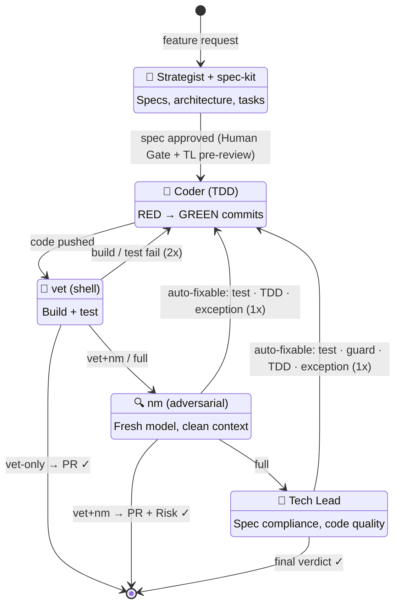

# Dokima — Pipeline Reference

`dokima` routes feature development through a pipeline of specialist AI agents: **Human Gate → Strategist → Coder → vet → nm → Tech Lead**, with automated depth-gating, filtered auto-fix loopbacks, and parallel execution. Works with Hermes Agent, Claude Code, or any agent runtime.

> **New here?** Start with [setup.md](setup.md) for deployment. Overview + design philosophy at [README.md](../README.md).

---

## Pipeline Diagram



---

## Phases

### Stage 0: Human Gate
**Why:** The #1 pipeline failure mode is building the wrong thing from a bad spec.
**Sees:** The spec. **Detects:** Misaligned intent. **Does NOT detect:** Code quality, edge cases.

Pauses after the strategist finishes, before any code gets written.

- **Interactive (TTY):** Shows spec path, branch name, depth decision. Options: `[y]` review in less, `[e]` edit in vim, `[Enter]` approve, `[q]` abort.
- **Non-interactive (Telegram/cron):** Auto-skips with a message.
- **Skip:** `PANEL_SKIP_HUMAN_GATE=1`

### Phase 1: Strategist
**Why:** Without a spec, an AI coder drifts — adding features, refactoring unrelated code, installing unnecessary dependencies. The strategist bounds the coder's ambition with a concrete design.
**Sees:** Codebase + AGENTS.md + brief. **Detects:** Unbounded ambition — overbuilding without design. **Does NOT detect:** Whether the spec is implementable.

Explores the codebase, reads `AGENTS.md`, searches for relevant code, understands existing patterns. Produces a 13-section spec including:

- Decision table comparing ≥2 approaches
- **Test plan** — concrete edge cases, failure modes, and contract invariants the coder must test (not generic strategy — specific cases)
- Impact assessment grounded in `git diff --stat` where available
- Confidence + Impact markers (for depth gating)
- API/interface proposal
- Numbered task list with `Parallelizable: yes/no` flags (5-15 min each, TDD-ready)

**Model:** `deepseek-v4-pro` with `spec-strategist-lite` + `ponytail-guard` skills.

**Interview mode:** When confidence < High, the strategist saves clarification questions to `/tmp/dokima-interview.json` and exits code 2. Re-run with `--answers` to continue.

### TL Spec Pre-Review (between Strategist and Coder)
**Why:** Architecture issues and test-plan gaps are cheapest to fix before code is written. TL reviews the spec — not the code — for architectural impact and test plan completeness.
**Sees:** The spec. **Detects:** Architectural coupling, implicit assumptions, migration gaps, vague test plans. **Does NOT detect:** Code-level issues (no code yet), misaligned intent (Human Gate catches that).

The Tech Lead profile reviews the strategist's spec BEFORE the coder touches anything. Two dimensions:

1. **Architectural Impact** — coupling risks, service boundaries, API contracts, migration needs, pattern consistency.
2. **Test Plan Verification** — is the Test Plan section present and concrete? Are edge cases specific? Are failure modes named? Missing or vague test plan = BLOCKER.

Findings are shown at the Human Gate — the user decides whether to revise the spec. No automatic refinement (unlike the old self-review loopback). Skip with `PANEL_SKIP_ORCHESTRATOR_REVIEW=1`.

### Phase 2: Coder
**Why:** A coder without a spec overbuilds. A coder without TDD writes untestable code. The panel's coder is constrained — spec-bound, TDD-enforced, task-granular.
**Sees:** Spec (incl. test plan) + task list. **Detects:** Implementation gaps — spec says X, code does Y. **Does NOT detect:** Whether the spec is correct.

Implements the spec on a `feat/<slug>` branch with TDD (RED→GREEN two-commit discipline):

- Panel schedules coders in waves based on the dependency DAG — independent tasks run in parallel (up to 5 worktrees), dependent tasks queue behind.
- Each coder gets 1-2 small tasks per wave.
- Uses `deepseek-v4-flash` (3.1× cheaper than v4-pro) with `ai-coding-best-practices-lite` skill.
- Before push: runs lint + full test suite. Fixes failures in-session.
- At `depth=vet`: creates PR directly. Otherwise pushes branch for downstream phases.

**Parallel mode** (default): Tasks with no file collisions run in parallel worktrees. `PANEL_PARALLEL=0` forces sequential.

### Phase 3: vet (Shell — Zero AI Tokens)
**Why:** AI agents claim "tests pass" without running them. Shell scripts don't hallucinate. vet is the minimum gate — deterministic, mechanical, zero hallucination surface.
**Sees:** Build + test output. **Detects:** Broken builds, failing tests — ground truth. **Does NOT detect:** Design issues, architecture drift.

Pure shell script. No AI agent. No tokens. No model.

1. Checkout feature branch
2. Run test command from `AGENTS.md`
3. Run build command from `AGENTS.md`
4. Report pass/fail

**Verification retry loop:** On test/build failure → spawn coder with failure output → fix → re-verify (up to 2 retries). BLOCKED if still failing after max retries.

**PR creation:** At `depth=vet`, the panel creates a basic PR after vet passes (nm creates the PR for deeper depths). The vet phase also handles the coder fix loopback when verification fails — spawning the coder to address build/test failures deterministically.

### Phase 4: nm (Adversarial Review)
**Why:** No model should grade its own homework. A fresh session with a different model family catches bias-blind spots the coder's model can't see.
**Sees:** Git diff (different model family). **Detects:** Model-family blind spots — same inductive bias would miss these. **Does NOT detect:** Spec compliance (doesn't see the spec).

Fresh session, different model family. The panel invokes `~/bin/nm --skip-tests` (tests already passed in vet):

1. Captures git diff from `HEAD~1` (or working tree)
2. Spawns a fresh Hermes session loading `no-mistakes` + `ai-coding-best-practices` skills
3. The spawned session runs the 7-stage nm pipeline:
   - Intent analysis (what was built and why)
   - Branch naming (conventional commit)
   - Rebase (onto latest main)
   - Fresh-context adversarial review (different model family — no memory of coding process)
   - Test rerun (skipped via `--skip-tests`)
   - Doc lint (stale references, missing updates)
   - Push + PR creation (with risk assessment: LOW/MEDIUM/HIGH)

**Why a different model family?** If the coder used DeepSeek, nm uses Anthropic or OpenAI. A model that didn't see the code being written catches bias-blind spots — the same model reviewing its own work misses edge cases.

**nm gets only the diff** — no spec, no feature description. This is adversarial by design: fresh eyes on the code, no bias from knowing intent. See [no-mistakes](https://github.com/kunchenguid/no-mistakes) for the original design.

### Phase 5: Tech Lead (depth=full only)
**Why:** nm reviews the code; TL reviews against the spec. TL is the coherence anchor — the only stage that asks "does this change make the system consistent?"
**Sees:** PR + spec + full context. **Detects:** Spec non-compliance, architecture drift, system-wide inconsistency. **Does NOT detect:** Blind spots from the coder's model family (nm covers that).

Three-part adversarial review against the spec using `deepseek-v4-pro` + `adversarial-review-lite` + `ponytail-guard` skills:

1. **Spec Compliance** — Approach matches decision table? API/interface matches? ALL tasks done? Scope creep?
2. **Architectural Impact** — New deps/coupling? Breaking changes? Deployment impact?
3. **Code Quality** — TDD, correctness, security, error handling, performance

**Severity:** BLOCKER (fix before merge) | SHOULD FIX (auto-creates GitHub Issues) | NIT (optional)

**Verdict:** APPROVED / CHANGES REQUESTED / BLOCKED

The TL reviews the PR created by nm. Verdict + risk + release type are appended to the PR body via `gh api PATCH`. Final sign-off before user merge.

---

## Depth Gating

Not every change needs all 5 stages. Confidence × impact → how many stages run:

| Impact ↓ / Confidence → | HIGH | MEDIUM | LOW |
|---|---|---|---|
| **LOW** (tests/docs/typos) | vet | vet+nm | full |
| **MEDIUM** (API/DB/UI) | vet+nm | full | full |
| **HIGH** (auth/payments) | full | full | full |

| Depth | Stages | When |
|-------|--------|------|
| **vet** | 0+1+2+3 | Trivial changes. Panel creates PR directly. |
| **vet+nm** | 0+1+2+3+4 | Medium-risk. nm creates PR with risk assessment. |
| **full** | 0+1+2+3+4+5 | Anything impactful or uncertain. Two independent reviews. |

Only HIGH confidence + LOW impact skips adversarial review. Everything else gets at least nm's fresh-model review. `PANEL_FORCE_FULL=1` overrides → all stages.

---

## Loopback Rules

Three loopback tiers, all re-vet after fix:

| Condition (diagram arrow) | Retries | Auto-fixes | Never auto-fixes |
|---------------------------|---------|-----------|-----------------|
| **build / test fail** (Validate → Implement) | 2 | Build failures, test failures | — (all mechanical) |
| **auto‑fixable: test · TDD · exception** (Verify → Implement) | 1 | Missing tests, uncaught exceptions, TDD violations, `unwrap` on Result/Option | Architecture concerns, spec compliance gaps, security findings |
| **auto‑fixable: test · guard · TDD · exception** (Review → Implement) | 1 | Missing tests, uncaught exceptions, TDD violations, missing guards, missing README update | Spec violations, architecture violations, security findings |

Subjective findings halt — human judges the trade-off. `PANEL_SKIP_AUTOFIX=1` disables Verify+Review auto-fix.

### Why filtered auto-fix?

- **nm is adversarial by design.** If it becomes a fix-it loop, it stops being adversarial and becomes a slow QA step. The human checks out — "nm will catch it."
- **No convergence guarantee.** nm finds X → coder fixes X → fix introduces Y → nm finds Y → coder fixes Y → reintroduces X. Two models playing whack-a-mole with no arbiter.
- **Some findings are trade-offs, not bugs.** nm flags "should use Redis." The spec chose in-memory for zero-dependency. Auto-fixing makes the coder "fix" a deliberate decision. Only the human knows which findings to honor.

---

## Interview Flow (Pause-and-Resume)

When the strategist cannot proceed with high confidence, it enters interview mode:

1. Panel exits with code 2
2. Saves questions + context to `/tmp/dokima-interview.json`
3. Orchestrator reads JSON, presents questions to user
4. User answers → orchestrator writes answers back to JSON
5. Re-run: `dokima --answers /tmp/dokima-interview.json "feature" ~/project`

The interview JSON captures full context (assumption, impact if wrong) for each question. This keeps the panel stateless and replayable — perfect for Telegram/cron workflows.

---

## Orchestrator Spec Review Loopback

After the Strategist produces a spec and the user interview gate resolves, the Orchestrator reviews the spec critically before handing off to the Coder. One round only.

**What the Orchestrator reviews:**
- Missing edge cases
- Unaddressed design decisions
- Assumptions not validated against code
- Integration points
- Test coverage gaps

Gaps are sent back to the Strategist for ONE refinement pass. Skip with `PANEL_SKIP_ORCHESTRATOR_REVIEW=1`.

---

## Quality Gates

After spec extraction, `verify_spec_quality()` runs four deterministic checks — all programmatic, no AI tokens:

| # | Gate | What it checks | Blocks? |
|---|------|---------------|---------|
| 1 | **Structure** | Impact, What Changed, and `### Task N:` headers present | Yes — blocks unless all 3 found |
| 2 | **Task field completeness** | Each task has all 5 fields (Files, Dependencies, Parallelizable, Description) | Yes |
| 3 | **PR body quality** | Detects thin fallback text (`"See diff for details"`) when the spec has real content | Warns only |
| 4 | **Brevity** | HIGH confidence > 5,000 chars, MEDIUM > 7,000 chars | Warns only |

On failure, the strategist gets **one re-prompt** with the failure list. If the re-prompt still fails, the spec proceeds with a warning — the pipeline always continues.

---

## Environment Variables

| Variable | Effect | Default |
|----------|--------|---------|
| `PANEL_REASONING=high` | Bump strategist reasoning effort | `medium` |
| `PANEL_PARALLEL=0` | Force sequential coder mode | `1` |
| `PANEL_FORCE_FULL=1` | Run all 5 stages regardless of depth matrix | off |
| `PANEL_SKIP_HUMAN_GATE=1` | Skip the human gate even in interactive mode | off |
| `PANEL_SKIP_AUTOFIX=1` | Disable nm+TL auto-fix loopbacks | off |
| `PANEL_SKIP_ORCHESTRATOR_REVIEW=1` | Skip orchestrator spec review loopback | off |
| `PANEL_AGENT` | Agent runtime: `hermes` (default), `claude`, `codex` | `hermes` |
| `GH_TOKEN` | GitHub auth for PR/issue creation | from `.env` |

---

## Token Optimizations

| Optimization | Mechanism | Saving |
|-------------|-----------|---------|
| Spec noise extraction | Strip session transcript (prompt echo, tool calls) from strategist output | Significantly smaller |
| Task-extract for coder | Generate `specs/<feature>-tasks.md` — coder reads condensed task breakdown | Substantially smaller read |
| Coder flash model | `deepseek-v4-flash` instead of v4-pro for implementation | Flash-tier pricing |
| Phase 3 pure shell (vet) | No AI agent — `git checkout`, test, build | Zero AI tokens |
| Phase 4 fresh nm session | Different model family catches bias-blind spots | One additional model call |
| Lite skills | Compressed skill files vs full equivalents | ~84% smaller files |

**Cost distribution by phase (approximate):**

| Phase | % of total |
|-------|-----------|
| Strategist | 58% |
| Coder | 8% |
| vet | 0% |
| nm | 15% |
| Tech Lead | 19% |

---

## Organizational Memory

For long-lived projects, every Strategist run shouldn't rediscover the same decisions. The panel integrates with [adr-tools](https://github.com/npryce/adr-tools) to capture and recall architectural decisions.

### ADR Lifecycle

**Before spec — Strategist reads existing ADRs.**
If `docs/adr/` exists, the Strategist runs `adr list` during codebase exploration and reads recent ADRs. Past decisions become context for the current design — no re-litigating whether to use Redis vs in-memory.

**After Human Gate — Panel creates a new ADR.**
Once the spec is final (user approved or edited), the panel extracts the Strategist's decision table and runs `adr new` to persist it as a numbered ADR in `docs/adr/`. Status: Proposed. The panel adds cross-references: ADR links back to spec, spec links forward to ADR.

**TL pre-review — checks spec against existing ADRs.**
TL runs `adr list` and checks whether the spec violates any existing architectural decision. Violations are flagged as CONCERN with the ADR reference — e.g. "ADR-0003 chose in-memory cache; this spec introduces Redis."

**Spec↔ADR cross-references.**
Each ADR gets `## Source` pointing to the spec that produced it. Each spec gets `## ADR` pointing to its decision record. After merge, the spec can be archived but the ADR persists — and you can trace "why was this decided?" via ADR → source spec.

## Spec Archive

Specs are temporary — write them, build from them, archive after merge. The panel handles this automatically.

**Auto-archive at startup.** Before each run, the panel checks `gh pr list --state merged` for any local spec directories with merged PRs. Archived specs move to `specs/archive/`. `specs/STATUS.md` is regenerated listing active vs archived specs. Skip with `PANEL_SKIP_AUTO_ARCHIVE=1`.

**Manual archive.** After merging a panel PR, you can also archive manually: `mv specs/<feature>/ specs/archive/`. The panel will pick up the change on next run.

### Setup

```bash
cd <project> && adr init docs/adr
```

One-time setup per project. The panel uses `adr-tools` as a CLI — no new agents, no new stages.

### What the panel won't do

The panel won't delete specs (only archives them), track false-BLOCKER history across runs, or remember which modules are fragile. Each run is self-contained — ADRs persist in the repo as markdown files, not as pipeline state.

---

## Failure Handling

When any phase fails, the panel:
1. Reverts ALL changes (deletes branch, `git checkout master`, clears stash)
2. Prints a `PIPELINE HALTED` summary with phase and reason
3. Prints "Orchestrator Action Required" checklist
4. Exits cleanly — **no automatic retry** without user approval

Per-phase timeout fallbacks:

| Phase | Timeout Response |
|-------|-----------------|
| Strategist | If output < 500 chars → abort pipeline |
| Coder | If branch exists → continue with partial output. If not → abort |
| vet | Fail → spawn coder to fix → re-verify (up to 2 retries). BLOCKED if still failing |
| nm | If nm exits non-zero → warn but continue (TL can review branch directly) |
| Tech Lead | Use partial output for verdict. Partial review > no review |

---

## File Structure

```
~/bin/dokima                        → canonical symlink (→ ~/dokima/dokima)
<project>/specs/<feature>/spec.md          → cleaned strategist spec
<project>/specs/<feature>/tasks.md         → task-extract for coder
<project>/.dokima/worktrees/         → parallel coder sandboxes
/tmp/dokima-output.txt              → full pipeline log
/tmp/dokima-interview.json          → interview state (exit code 2)
```

## Companion Scripts

| Script | Purpose |
|--------|---------|
| `~/bin/nm` | Phase 4 (adversarial review + PR) and standalone manual validation |
| `~/bin/vet` | Standalone shell verification (build+test) for manual pre-commit checks |

---

## Exit Codes

| Code | Meaning |
|------|---------|
| `0` | Pipeline complete — PR created, all phases passed |
| `1` | Pipeline halted — unrecoverable error (BLOCKER, failed verification) |
| `2` | Interview mode — strategist needs clarification. Re-run with `--answers` |

---

## Requirements

- Python 3.6+ (compatible with Oracle Linux 8 system Python)
- Hermes Agent installed with 3 profiles (strategist, coder, tech-lead)
- `gh` CLI (GitHub) installed and authenticated
- DeepSeek API access (strategist/coder/TL) + one additional model family (nm adversarial review)
- `AGENTS.md` at project root with test, build, and lint commands
- GitHub remote configured (`git remote get-url origin`)
- `GH_TOKEN` + `GITHUB_TOKEN` in environment
